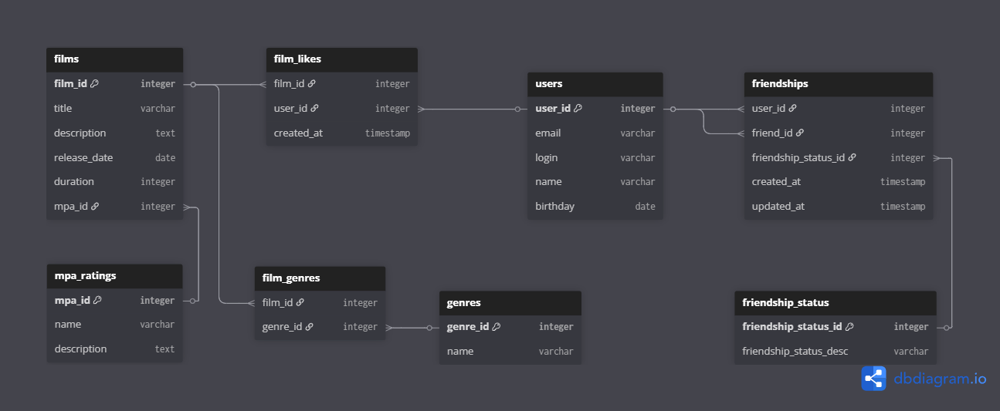

# java-filmorate
Template repository for Filmorate project.

# ER-диаграмма

# Основные сущности:
users - пользователи приложения
films - фильмы с основной информацией
mpa_ratings - возрастные рейтинги (G, PG, PG-13, R, NC-17)
genres - жанры фильмов
friendship_status - статусы дружбы (подтвержденная/неподтвержденная)

# Связующие таблицы:
film_genres - связь многие-ко-многим между фильмами и жанрами
film_likes - лайки пользователей фильмам
friendships - отношения дружбы между пользователями

# Примеры запросов
## Получение всех фильмов с жанрами и MPA
SELECT
f.film_id,
f.title,
f.description,
f.release_date,
f.duration,
m.name AS mpa_rating,
m.description AS mpa_description,
GROUP_CONCAT(g.name) AS genres
FROM films f
JOIN mpa_ratings m ON f.mpa_id = m.mpa_id
LEFT JOIN film_genres fg ON f.film_id = fg.film_id
LEFT JOIN genres g ON fg.genre_id = g.genre_id
GROUP BY f.film_id
ORDER BY f.film_id;

## Топ N популярных фильмов по лайкам
SELECT
f.film_id,
f.title,
f.description,
f.release_date,
f.duration,
m.name AS mpa_rating,
COUNT(fl.user_id) AS likes_count,
GROUP_CONCAT(g.name) AS genres
FROM films f
JOIN mpa_ratings m ON f.mpa_id = m.mpa_id
LEFT JOIN film_likes fl ON f.film_id = fl.film_id
LEFT JOIN film_genres fg ON f.film_id = fg.film_id
LEFT JOIN genres g ON fg.genre_id = g.genre_id
GROUP BY f.film_id
ORDER BY likes_count DESC
LIMIT 10;

## Добавление пользователя
INSERT INTO users (email, login, name, birthday)
VALUES ('user@example.com', 'user123', 'User Name', '1990-01-01');